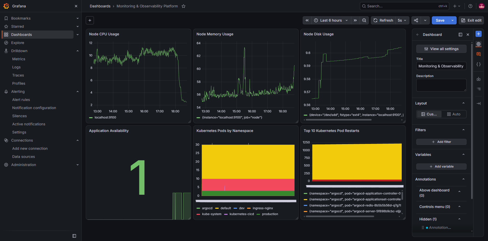

# Monitoring & Observability Platform

A hands-on DevOps monitoring project that collects metrics from a Node.js application, a Linux host, and a Kubernetes cluster, visualizes them in Grafana, and raises alerts through Prometheus and Alertmanager.

## Overview

The project monitors three areas:

- A small Node.js application that exposes Prometheus metrics at `/metrics`
- Linux host resources (CPU, memory, disk) using Node Exporter
- Kubernetes workloads (pods, namespaces, restarts) using Kube State Metrics

Prometheus scrapes all targets and evaluates alert rules. Firing alerts are sent to Alertmanager. Grafana reads from Prometheus and shows everything in a single dashboard.

## Architecture

```text
                +----------------------+
                |    Node.js App       |
                |   :3001 /metrics     |
                +----------+-----------+
                           |
Linux Host --> Node Exporter (:9100) ----+
                           |             |
Kubernetes --> Kube State Metrics -------+
                                         |
                                         v
                              +--------------------+
                              |    Prometheus      |
                              |       :9090        |
                              +---------+----------+
                                        |
                        +---------------+---------------+
                        |                               |
                        v                               v
                +---------------+              +----------------+
                |    Grafana    |              |  Alertmanager  |
                |     :3000     |              |      :9093     |
                +---------------+              +----------------+
```

## Technologies Used

- Prometheus
- Grafana
- Alertmanager
- Node Exporter
- Kube State Metrics
- Docker
- Kubernetes (Minikube)
- Node.js
- Linux, Bash
- Git and GitHub

## Project Structure

```text
monitoring-observability-platform/
├── app/
│   ├── server.js
│   ├── package.json
│   └── package-lock.json
├── docker/
│   └── Dockerfile
├── prometheus/
│   ├── prometheus.yml
│   └── rules/
│       ├── app-alerts.yml
│       ├── node-alerts.yml
│       └── kubernetes-alerts.yml
├── screenshots/
│   └── (01 to 25, see the Screenshots section)
├── .gitignore
└── README.md
```

## Application

The Node.js application listens on port `3001` and exposes three endpoints:

| Endpoint   | Purpose                              |
|------------|--------------------------------------|
| `/`        | Basic application information        |
| `/health`  | Health check                         |
| `/metrics` | Prometheus-format metrics            |

```bash
curl http://localhost:3001/
curl http://localhost:3001/health
curl -s http://localhost:3001/metrics
```

Example `/health` response:

```json
{
  "status": "healthy",
  "application": "monitoring-demo-app",
  "version": "1.0.0",
  "environment": "production"
}
```

## Docker

Build the image:

```bash
docker build -f docker/Dockerfile -t monitoring-observability-app:1.0.0 .
```

Run the container:

```bash
docker run -d \
  --name monitoring-observability-app \
  -p 3001:3001 \
  -e APP_VERSION=1.0.0 \
  -e ENVIRONMENT=production \
  monitoring-observability-app:1.0.0
```

Check the container and its logs:

```bash
docker ps
docker logs monitoring-observability-app
```

## Prometheus

The configuration is in `prometheus/prometheus.yml`. Prometheus scrapes these targets:

| Job                  | Target                  |
|----------------------|-------------------------|
| `devops-app`         | `localhost:3001`        |
| `node`               | `localhost:9100`        |
| `kube-state-metrics` | `192.168.49.2:30491`    |
| `prometheus`         | `localhost:9090`        |

Check target health:

```bash
curl -s http://localhost:9090/api/v1/targets
```

### Example PromQL queries

Application availability:

```promql
up{job="devops-app"}
```

Node CPU usage (%):

```promql
100 - (avg by(instance) (rate(node_cpu_seconds_total{mode="idle"}[5m])) * 100)
```

Node memory usage (%):

```promql
(1 - (node_memory_MemAvailable_bytes / node_memory_MemTotal_bytes)) * 100
```

Node disk usage (%):

```promql
(1 - (
  node_filesystem_avail_bytes{fstype!="rootfs",mountpoint="/"}
  /
  node_filesystem_size_bytes{fstype!="rootfs",mountpoint="/"}
)) * 100
```

Kubernetes pods per namespace:

```promql
count by (namespace) (kube_pod_info)
```

## Alert Rules

Alert rules are stored in `prometheus/rules/`:

| File                   | Covers                                       |
|------------------------|----------------------------------------------|
| `app-alerts.yml`       | Application availability                     |
| `node-alerts.yml`      | High CPU, high memory, low disk space        |
| `kubernetes-alerts.yml`| Kubernetes workload and pod conditions       |

The application alert fires when Prometheus cannot scrape the app for the configured duration:

```promql
up{job="devops-app"} == 0
```

Rules can be viewed at `http://localhost:9090/rules` and active alerts at `http://localhost:9090/alerts`.

## Alertmanager

Alertmanager receives alerts from Prometheus and handles grouping and notifications. It runs at `http://localhost:9093`.

The alert flow was tested by stopping the Node.js application and starting it again:

```text
Normal -> Pending -> Firing -> Resolved
```

Prometheus marked the target as down, the alert moved to firing and appeared in Alertmanager, and after the application was restarted the alert resolved.

## Node Exporter

Node Exporter exposes Linux host metrics at `http://localhost:9100/metrics`, including CPU, memory, disk, filesystem, and network statistics. Prometheus scrapes these and Grafana displays them.

## Kubernetes Monitoring

The project uses a local Minikube cluster. Kube State Metrics runs inside the cluster and is exposed through a NodePort so Prometheus can scrape it. It provides metrics for pods, deployments, replica sets, namespaces, pod readiness, and restart counts.

```bash
kubectl get nodes
kubectl get namespaces
kubectl get pods -A
```

## Grafana

Grafana runs at `http://localhost:3000` with Prometheus configured as the data source.

The **Monitoring & Observability Platform** dashboard contains these panels:

- Node CPU Usage
- Node Memory Usage
- Node Disk Usage
- Application Availability
- Kubernetes Pods by Namespace
- Top 10 Kubernetes Pod Restarts

Grafana alerting was also explored: alert rules, contact points, notification policies, and notification templates.

## Screenshots

All screenshots are in the `screenshots/` directory.

| # | Screenshot |
|---|------------|
| 01 | Docker container |
| 02 | Application health |
| 03 | Application metrics |
| 04 | Prometheus targets |
| 05 | Prometheus application metric |
| 06 | Prometheus Node.js metrics |
| 07 | Prometheus alert rules |
| 08 | Alertmanager |
| 09 | Prometheus alert firing |
| 10 | Alertmanager firing |
| 11 | Prometheus alert resolved |
| 13 | Prometheus Kubernetes metrics |
| 14 | Kubernetes pod readiness |
| 16 | Node CPU usage |
| 17 | Node memory usage |
| 18 | Node disk usage |
| 19 | Grafana Prometheus data source |
| 20 | Grafana monitoring dashboard |
| 21 | Grafana alert rules |
| 22 | Grafana contact points |
| 23 | Grafana notification policies |
| 24 | Grafana notification templates |
| 25 | Monitoring application alerts |

Example:



## Local Services

| Service        | URL                     |
|----------------|-------------------------|
| Application    | http://localhost:3001   |
| Prometheus     | http://localhost:9090   |
| Grafana        | http://localhost:3000   |
| Alertmanager   | http://localhost:9093   |
| Node Exporter  | http://localhost:9100   |

## What I Practiced

- Building and containerizing a Node.js app with Prometheus metrics
- Configuring Prometheus scrape targets and writing PromQL queries
- Monitoring Linux resources with Node Exporter
- Monitoring Kubernetes workloads with Kube State Metrics
- Writing Prometheus alert rules and testing firing and resolution
- Working with Alertmanager
- Building Grafana dashboards and configuring Grafana alerting
- Troubleshooting scrape targets and application availability
- Managing the project with Git and GitHub

## Environment

Built and tested locally on Linux using Docker and Minikube.

## Conclusion

This project covers a complete monitoring workflow: collecting metrics from an application, a Linux host, and Kubernetes, visualizing them in Grafana, and alerting through Prometheus and Alertmanager. It is a practical DevOps portfolio project built in a local environment.
